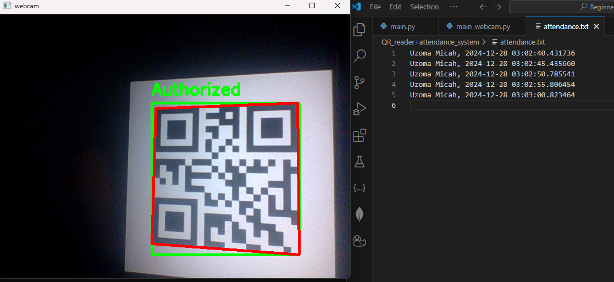
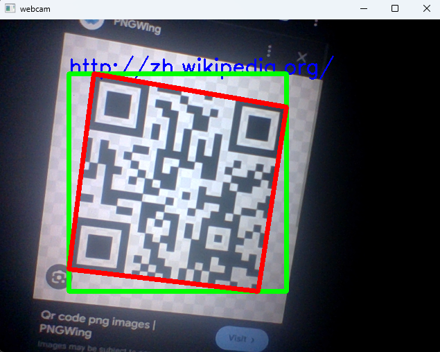
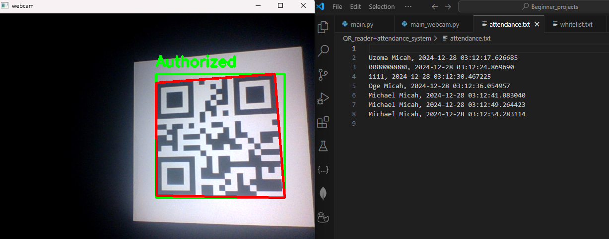
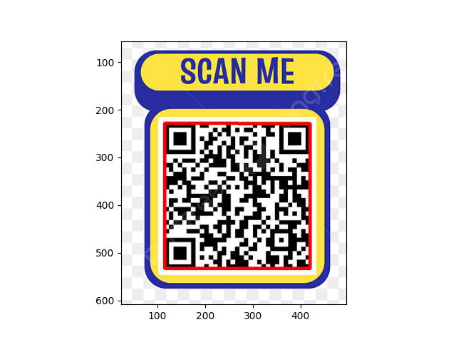

# QR Code Reader and Attendance System

This project implements a QR code-based attendance system. It scans QR codes using a webcam, checks the scanned data against a whitelist, and logs attendance with timestamps into a file. The system also provides a static example to decode QR codes from an image file.

---

## Features

- **Live QR Code Scanning**: Uses a webcam to scan QR codes in real-time.
- **Whitelist Authorization**: Verifies scanned QR codes against a list of authorized users.
- **Attendance Logging**: Logs the authorized user's name and timestamp in a text file.
- **Static QR Code Decoding**: Processes QR codes from image files for analysis.
- **Visual Feedback**: Displays bounding boxes and labels on scanned QR codes to indicate authorization status.

---

## Project Structure

```
QR_reader_attendance_system/
├── main.py                 # Static QR code decoding script
├── main_webcam.py          # Real-time QR code scanning script
├── whitelist.txt           # Authorized users list
├── attendance.txt          # Attendance log file
├── requirements.txt        # Required Python dependencies
├── figure_1.png            # Example output image
├── QR_codes/               # Directory for QR code images
└── README.md               # Project documentation (this file)
```

---

## Installation

### Prerequisites
Ensure you have Python installed on your system. This project requires Python 3.7 or higher.

### Install Dependencies
Run the following command to install the required dependencies:

```bash
pip install -r requirements.txt
```

---

## Usage

### 1. Real-Time QR Code Scanning

To scan QR codes using your webcam:

```bash
python main_webcam.py
```

- Displays a live feed from the webcam.
- Scans and identifies QR codes in the feed.
- Logs authorized users into `attendance.txt` with a timestamp.
- Press `q` to quit the live feed.

### 2. Static QR Code Decoding

To process a QR code image:

1. Place your QR code image in the `QR_codes` directory.
2. Update the `input_dir` variable in `main.py` with the file path of the QR code image.
3. Run the script:

```bash
python main.py
```

- Displays the decoded QR code information.
- Annotates the image with bounding boxes and polygons around detected QR codes.
- Outputs the processed image with annotations.

---

## Files

### 1. `main_webcam.py`

This script performs real-time QR code detection and attendance logging. Key features include:

- **Whitelist Validation**: Matches scanned QR data with the whitelist.
- **Attendance Logging**: Records the user and timestamp in `attendance.txt`.
- **Visual Indicators**:
  - Green box: Authorized user.
  - Red box: Unauthorized user.

### 2. `main.py`

This script decodes QR codes from a static image. Key features include:

- Decodes the QR data, bounding boxes, and polygon shapes.
- Displays the processed image with annotations.

### 3. `whitelist.txt`

Contains the list of authorized QR code data (e.g., names or IDs). Example format:

```
0000000000
1111
Michael Micah
Uzoma Micah
Oge Micah
```

### 4. `attendance.txt`

Logs attendance with the following format:

```
AuthorizedUserID, Timestamp
```

### 5. `requirements.txt`

Lists the Python dependencies:

```
opencv-python
pyzbar
matplotlib
numpy
```

---

## Example Output

### Real-Time QR Code Scanning





### Static QR Code Decoding
Outputs the processed image with bounding boxes and polygons drawn around detected QR codes.

---

## Notes

- Ensure your webcam is functional for real-time scanning.
- The `whitelist.txt` file must contain valid entries to verify QR codes.
- Modify `main.py` and `main_webcam.py` to customize paths or add additional functionality.

---

## License
This project is open-source and available under the [MIT License](LICENSE).

---

## Author
Michael Chukwuemeka Micah
